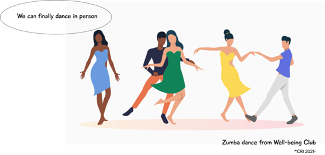

# Open-Science-Team-5
# COMPARISONS OF STUDENT ENGAGEMENT IN UNIVERSITY CLUBS THROUGHOUT COVID-19 PANDEMIC PERIOD
## Open Science course (2021-2022) 

**Title:** "COMPARISONS OF STUDENT ENGAGEMENT IN UNIVERSITY CLUBS THROUGHOUT COVID-19 PANDEMIC PERIOD"\
**Objectif:** "Measure club-participation numbers at the CRI over the last three years and conduct a time-scale analysis in correlation with the COVID-19 pandemic to see if the student engagement has changed due to the pandemic."\
**Lab:** Open Science, CRI Paris  
**Supervisors:** Bastian Greshake Tzovaras and Ariel Lindner  

## Description
Extracurricular activities are an important part of student life, perhaps impacting many areas, ranging from health and wellbeing to academic performance. The COVID-19 pandemic may have had an impact on students’ participation in university clubs, and subsequently students’ wellbeing and academic engagement. We aim to explore this in our study.

## Who are we and how can you help?
We are a team of six CRI students, from Learning Sciences, Digital Science and Life Science. Are you a CRI student? Do you want to have an impact in education research and help universities to be more resilient to traumatic events? We kindly invite you to have your say in our anonymous study by taking part in a survey which should not take more than ten minutes of your time! 

